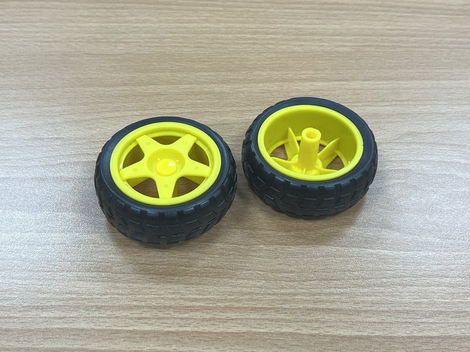

# 各式零件介紹

## 時間

此段內容應講解時間：9:30~12:00

## 內容

一開始時請所有人清點好材料是否齊全

從左到右，從上至下的材料分別為:

1. 小車車底板 一片

2. Arduino UNO 一個

3. Arduino UNO 擴充板 一個 (Sensor Shield V5.0 for Arduino®)

4. L298N 馬達驅動板 一個

5. 馬達電線 兩根 (一根中含正負電線，比一般電線較粗)

6. Arduino 數據線 一個

7. TCRT5000 紅外線反射模組 一個

8. 馬達固定片 四個 (裝在底盤)

9. HC-SR04 超音波感測器 及其 固定片+螺絲螺帽

10. 萬向輪 一個

11. 輪子 兩個

12. 電池盒 一個 + 三號電池 兩個 + 電池充電器 一個

13. 馬達套組 兩個

14. 至少一組 公對母杜邦線 及 母對母杜邦線

15. 測速碼盤 兩個 (此次教學不會用到)

16. 長螺絲及其對應螺帽 各四個

17. 短螺絲及其對應螺帽 各十二個

18. 頂端為平面的螺絲 兩個 (此次教學不會用到)

19. 另一頭為螺絲的長螺帽 兩個 (此次教學不會用到)

20. Arduino JoyStick 搖桿模組 及 遙控線 各一個

以下為各零件介紹

## 底板套件

嗯哼，本次車車框架的底板，樣子大概就醬，可以介紹各個零件，底板、橡膠輪、萬向輪、馬達、馬達支架、測速碼盤、開關。

## Arduino UNO

主要負責裝置中的電路控制，輸出訊號等

## Arduino 擴充板

可將 Arduino UNO 本身的腳位更方便的做使用，在此次實作充當類似麵包板的用途

(可順便介紹麵包板 以利充時間及講回來擴充板的腳位礦充方式)

## L298N 馬達驅動板

可藉由 Arduino 輸出的訊號，判斷電源的輸出，導到馬達的前後或不輸出

(可介紹邏輯規則)

## 電池、電池盒、充電座

就電池

## 杜邦線

與 Arduino 對接的裝置做使用，可以講用法就是插在 Arduino 的那個針孔

## 搖桿

輸出搖桿的位置信號供 Arduino 使用，可解釋搖桿輸出信號的原理，操作可變電阻輸出信號

## 超音波模組

通過此模組可檢測距離前方物品的距離(有上限)

## TCRT5000 紅外線循跡模組

循跡，檢測模組前方亮度做循跡功能使用，可第三天再介紹到細部

## 魔鬼氈、USB線、熱縮套管

魔鬼氈：把裝置黏在底盤上面用的

USB線：用來連接 Arduino 與 電腦

熱縮套管：用在遙控線上面
