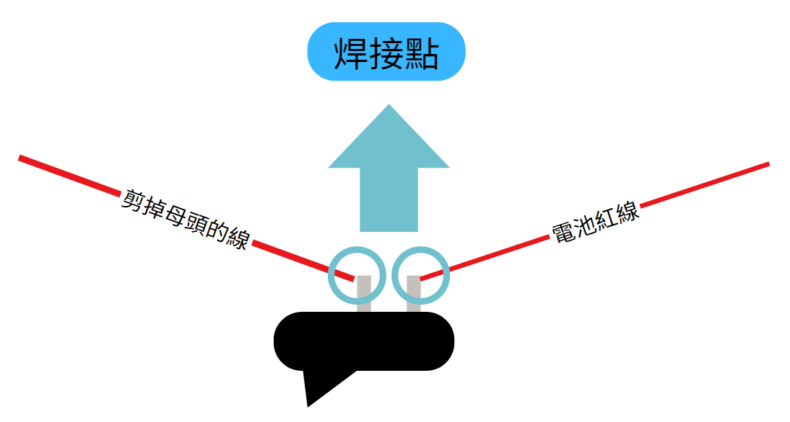
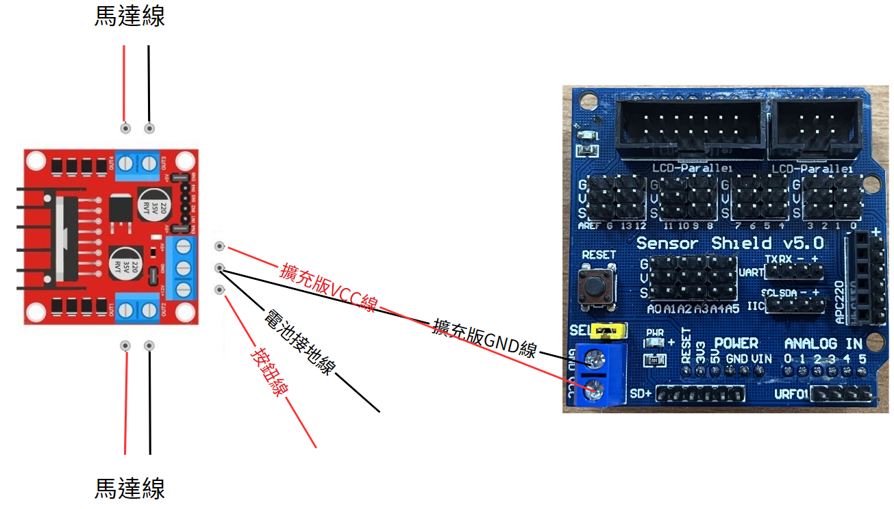
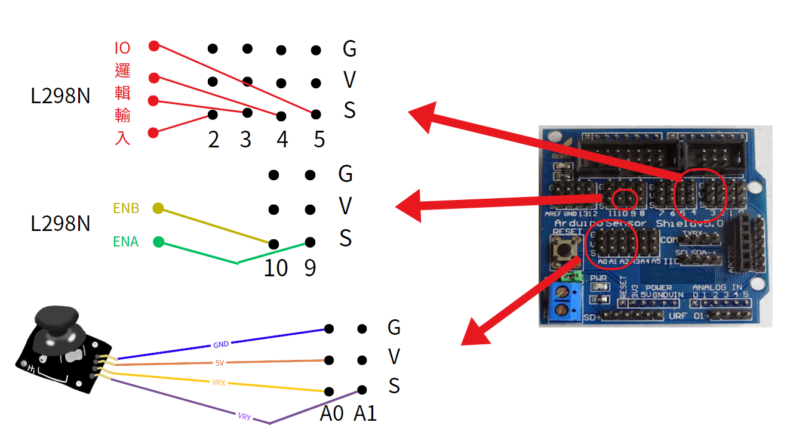
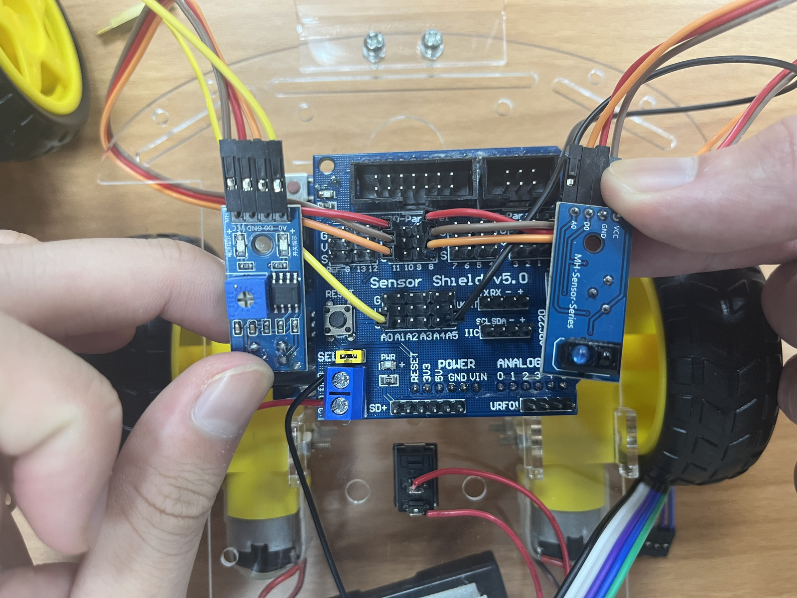

# 小車車組裝步驟

## 時間

此段內容應講解時間：13:00~16:00

## 內容

### 第一段：焊接零件

所需零件：馬達(兩個)、馬達線(紅、黑各兩個)、杜邦線(公母線四條)、遙控線(一條)

可先放一段焊接教程再開始實作，包含完整的焊接教學，以免學生在操作時受傷。

焊接注意事項：

```txt
1. 不要摸烙鐵加熱的地方

2. 焊接時，請在通風的環境中作業

3. 焊接時，盡量不要吸入焊接時產生的煙霧

4. 盡量減少焊接時加熱的時間

5. 焊接時不要碰到元件旁的塑膠等材質

6. 沒有要使用時請將烙鐵放在烙鐵架上，並且將插頭拔除
```

焊接步驟：

```txt
1. 將烙鐵插上插頭加熱

2. 將烙鐵放在需焊接零件上加熱

3. 加熱一段時間後，將焊錫碰觸烙鐵使焊錫融化

4. 待焊錫成功將零件結合在一起後，將烙鐵移開零件
```

每個馬達都需焊接上兩條馬達線(紅、黑各一)。

再來是遙控的部分，須將四條公母線各對半剪，並且各焊接在遙控線上面的各四條線(需先剝開、剪線)，一頭公，一頭母，才可以母頭接上遙控模組，另一頭接上 Arduino 板子。

範例教學影片:

https://github.com/umeow-side-projects/Arduino-Camp/blob/main/images/%E7%84%8A%E6%8E%A5%E7%AF%84%E4%BE%8B.mp4

### 第二段 組裝輪子

所需零件：底板(一個)、萬向輪(一個)、橡膠輪(兩個)、M4長螺絲及其銅柱(四個)、小螺絲及其螺帽(各十二個)、已焊馬達(兩個)、馬達支架(四個)


理想完成圖：


### 第三段 電源、開關

所需零件：魔鬼氈、開關、電池盒、L298N

將開關及電池盒用雙面膠固定在車子的底板底部。

之後將開關的一頭焊上電池盒的正極，再來將開關的另外一頭焊上一條紅線，然後紅線的另外一頭壓進 L298N 的 +12V 孔，電池盒的負極壓進 L298N 的 GND。

(實作上可因方便改變固定零件的先後順序)



### 第四段 電控板板、繼電器

所需零件：Arduino、Arduino 擴充板、L287N

將 Arduino 插上 擴充板 後，將 Arduino 固定在底板上。

之後從 L298N 從 +5V 接出來一條單頭杜邦(一邊線，一邊母頭杜邦)，線壓進 L298N，以及杜邦壓進 Arduino 擴充板 上面的 VCC 孔。

然後從 Arduino 擴充板 上接出來 GND 把另一頭壓進 L298N 的 GND (一樣使用單頭杜邦)。

此時電池盒通電後將會經過 L298N 通電給 Arduino，因為要讓電路形成迴路，所以需要把 Arduino 的 GND 接上 L298N 來使共地。

最後將兩個馬達的正負極都壓進 L298N 的 OUT 孔(一顆馬達一頭)，最後將 L298N 固定在底板之上。




### 第五段 遙控它！！！

接線表

```txt
遙控器GND孔 -> A0 G
遙控器+5V孔 -> A0 V
遙控器VRX孔 -> A0 S
遙控器VRY孔 -> A1 S
l298N通道A跳線(ENA)  -> 9  S
l298N 通道B跳線(ENB) -> 10 S
l298N IO邏輯輸入     -> 2 3 4 5 S
```



此時用 Arduino 用 A0 及 A1 角為用來接收搖桿的 X Y 類比訊號。

而 2 3 4 5 腳位用來控制 L298N 的 IN1~4 來控制 電源 至 OUT 使馬達運作及方向改變。

而 9 及 10 角為分別控制 OUT1 2 及 OUT3 4 的輸出電源大小
輸出數值可為 analogWrite 0 ~ 255。

### 第六段 紅外線模組

接線表

```txt
A紅外線GND孔 -> 11 G
A紅外線VCC孔 -> 11 V
A紅外線A0孔  -> A2 S
A紅外線D0孔  -> 11 S

B紅外線GND孔 -> 8 G
B紅外線VCC孔 -> 8 V
B紅外線A0孔  -> A3 S
B紅外線D0孔  -> 8 S
```



此時可用腳位 11, 8 以 digitalRead 來檢測紅外線模組鏡頭前方偵測到的顏色為黑或白色。

## 建議

中間一樣可插入多個閒聊分為降低與學弟妹隔閡或以充時間

教完後即今日課程的結束，因此如有人還沒做完可能須個別指導。