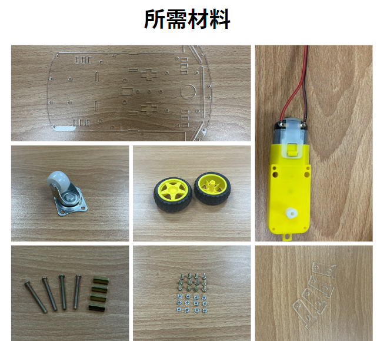
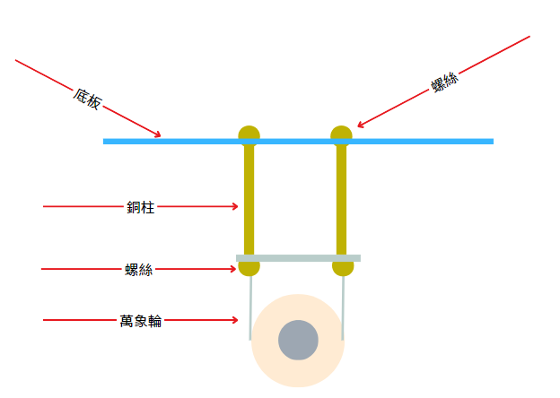
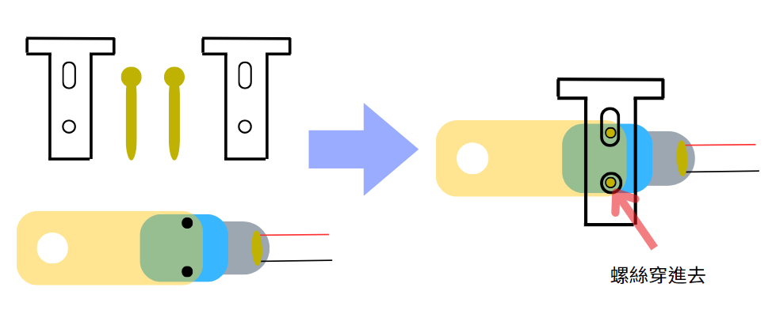
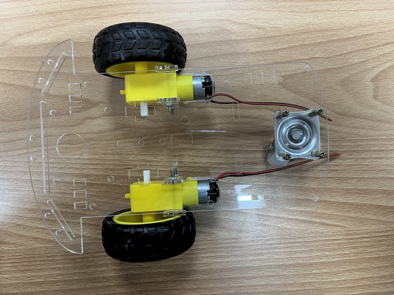

# 小車車組裝步驟

## 時間

此段內容應講解時間：13:00~16:00

## 內容

### 第一段：焊接零件

所需零件：馬達(兩個)、馬達線(紅、黑各兩個)、杜邦線(公母線四條)、遙控線(一條)

可先放一段焊接教程再開始實作，包含完整的焊接教學，以免學生在操作時受傷。

焊接注意事項：

```txt
1. 不要摸烙鐵加熱的地方

2. 焊接時，請在通風的環境中作業

3. 焊接時，盡量不要吸入焊接時產生的煙霧

4. 盡量減少焊接時加熱的時間

5. 焊接時不要碰到元件旁的塑膠等材質

6. 沒有要使用時請將烙鐵放在烙鐵架上，並且將插頭拔除
```

焊接步驟：

```txt
1. 將烙鐵插上插頭加熱

2. 將烙鐵放在需焊接零件上加熱

3. 加熱一段時間後，將焊錫碰觸烙鐵使焊錫融化

4. 待焊錫成功將零件結合在一起後，將烙鐵移開零件
```

每個馬達都需焊接上兩條馬達線(紅、黑各一)。

再來是遙控的部分，須將四條公母線各對半剪，並且各焊接在遙控線上面的各四條線(需先剝開、剪線)，一頭公，一頭母，才可以母頭接上遙控模組，另一頭接上 Arduino 板子。

範例教學影片:

<video src="../images/焊接範例.mp4"></video>

### 第二段 組裝輪子

所需零件：底板(一個)、萬向輪(一個)、橡膠輪(兩個)、M4長螺絲及其銅柱(四個)、小螺絲及其螺帽(各十二個)、已焊馬達(兩個)、馬達支架(四個)







理想完成圖：

