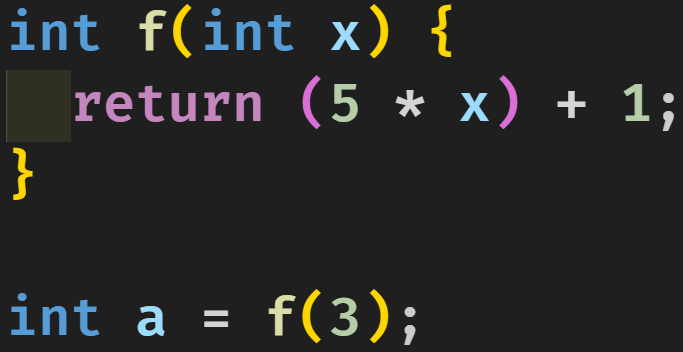

# 程式基礎教學

## 時間

此課程時間為第二天早上的 9:30~12:00

## 課程內容

### 第一段 Arduino IDE 安裝及設置

1. 首先在 Google 上面搜尋 Arduino 並進到官方網站

2. 點擊導覽列上面的 Software 即可看見軟體下載選項

3. 點擊 Windows 64bit MSI installer 下載安裝檔

4. 在跳出來的視窗上面點擊 JUST DOWNLOAD 就會開始下載檔案了

5. 開啟下載下來的 installer 之後 agree 條款並直接 next 到底即下載完成 並按下 close 關閉視窗

6. 在桌面上可開啟 Arduino IDE 軟體

以下動作請在 Arduino 連接電腦並確認環境有網路情況下進行

1. 前往工具列按下 `工具` 選項，並選擇 `開發板` 選擇開發板為 `Arduino Uno`

2. 在 `序列埠` 底下選取目前接至電腦的 `COM` 裝置

即完成 Arduino 的設置

### 第二段 資料類別

---

(下表以 Arduino 編譯器當標準)

| 類型                | 中文        | 資料大小         |
|-                   | ---        | ------------    |
| bool               | 布林        | 1 byte          |
| char               | 字元        | 1 byte          |
| int                | 整數        | 2 bytes         |
| unsigned int       | 無號整數     | 2 bytes         |
| long               | 長整數       | 4 bytes          |
| unsigned long      | 無號長整數    | 4 bytes         |
| long long          | 超長整數      | 8 bytes         |
| unsigned long long | 無號超長整數   | 8 bytes        |
| float              | 浮點數        | 4 bytes        |
| double             | 雙倍精準浮點數 | 8 bytes        |

其中 bool 為 true or false

而 char 為各種字元 包含 a-z 或 0-9 但不包含中文字等

那有沒有 long long long?


答：沒有，too long。

### 第二段 byte? 那是什麼

---

1 byte 由 8 bits 所組成

1 bit 可表示為 0 或是 1

表示 2 bit 能分別表示為 00 01 10 11

代表 2 bit 能夠表示 $2^2=4$ 種狀態

3 bit 能分別表示為 000 001 010 011 100 101 110 111

3 bit 能夠表示 $2^3=8$ 種狀態

由此可知 1 byte = 8 bits

故 1 byte 可表示為 $2^8=256$ 種狀態

因此 1 byte 的 int 可表示從 -128~127 的數字

而 unsigned int 可表示從 0~255 種數字 (0 也是一種狀態)

數字的正負表示在非無號數的資料型別裡面，通常會用第一個 bit 來表示是否有號

開頭為 0: 無號 (正數)
開頭為 1: 有號 (負數)

### 第三段 資料型態的應用 - 變數的宣告

---

因在這個程式語言的格式規定，都需要個;來當作結尾符號，因此可以無視。

變數宣告的結構分為


int -> 資料型態

a   -> 變數名稱

(講解時請用原程式上顏色拉下來解釋)


int -> 資料型態

a   -> 變數名稱

=   -> 就是等號

0   -> 資料數值

可換另一個資料型態來舉例


而變數的命名有規定，規定如下

```txt
變數名稱不能以數字作為開頭 ex. 1a (X)

變數名稱只能含有 數字、英文字母、及半形底線(_)

變數名稱不能與保留單字衝突 ex. if, for, while 
```

並且在宣告之後，程式會知道此變數它的資料型態，故不用繼續註明


### 第3.5段 字元型態

---

以單引號框起來的是字元

```c
char a = 'c';
```


以雙引號框起來的是字元陣列

```c
char a[] = "abc";
```


中文屬於字元陣列，因為沒辦法把中文儲存在 1 byte 的空間，因此必須這樣定義

```c
char str[] = "嗨";
```


所以說 字元不能被這樣定義

```c
char c = "a"; // 雙引號 錯誤
```


```c
char str[] = 'c'; // 單引號 錯誤
```


### 第四段 算術運算子

---

| 符號         | 名稱      | 說明                  |
| ----------- | --------- | ---------            |
| =           | 指派運算子  | 左邊數值賦予右邊變數     |
| +           | 加法運算子  | 左右數值相加           |
| -           | 減法運算子  | 左數值減右數值         |
| *           | 乘法運算子  | 左右數值相乘           |
| /           | 除法運算子  | 左數值除以右數值        |
| %           | 餘數運算子  | 取左數值除以右數值的餘數 |

實際範例

加法運算子


乘法運算子


除法運算子


在 a 中 $5/3$ 會被轉換為 int 所以會是 1

ex.


在 b 中 $5/3$ 因為兩者都是整數，所以採用整數值計算，return 一個 int，故 b = 1.0


而在 c 跟 d 中，因為前後兩數值其一是浮點數則，使用浮點數計算，return 一個 double，故 $c=d$ 且 $c=1.666......$

而不管是加減乘除運算子都是採這種計算方式(前後有一浮點數，就採浮點數運算)

餘數運算子


$a = 1$


$a = 16$

在算術運算子中有分先後順序問題，先處理乘除，後加減，但建議還是加上括弧，以視先後順序。


$a = 16$

相比起來較具有可讀性，在其他運算上也可藉由括弧起來提高可讀性。

---

### 第五段 複合運算子

| 符號         | 名稱      | 說明                  |
| ----------- | --------- | ---------            |
| +=          | 加法運算子  | 右數值相加            |
| -=          | 減法運算子  | 左數值減右數值         |
| *=          | 乘法運算子  | 左右數值相乘           |
| /=          | 除法運算子  | 左數值除以右數值        |
| %=          | 餘數運算子  | 取左數值除以右數值的餘數 |

多用於變數的修改

假設我想要讓 x 變數遞增 1

可以當作

```c
int x = 1;
x += 1;
```


相等於

```c
int x = 1;
x = x + 1;
```


此時 x 就會等於 2

---

記住算式太複雜可套用括弧

```c
int x = 7;
x %= 3 + 1;
```


覺得難看，應當使用

```c
int x = 7;
x %= (3 + 1);
```


相等於

```c
int x = 7;
x = x % (3 + 1);
// 或是
x = x % 4;
```


### 第六段 函式宣告

可用國中學過的方程式舉例

假設我有一函式 $f(x)=5x+1$

則可以變成以下程式

```c
int f(int x) {
  return (5 * x) + 1;
}
```


其中 

第一個 int 為 f 此函式回傳的資料型態

也就是 return 的 (5 * x) + 1 本身會是一個整數值

而 f 代表你定義的函式的名稱 可自訂，但有命名標準(跟變數一樣)

而括弧裡面塞的是你函式參數，比如說我函數裡面會輸入一個整數 x，則會像那樣定義

而 {} 裡面是函式的執行區塊

如果沒有參數則直接 `int f(){ .....` 定義

---

假設你有一個函式 $g(x, y)=x+y+0.01$

```c
// 可用 float 或是 double 當作回傳的資料型態

float g(float x, float y) {
  return x + y + 0.01;
}
```


在此函式中回傳資料型態為 float 

且 x, y 皆為整數值

---

而有一種回傳資料型態 叫做 void

```c
void func() {
  return;
}

// or

void func2() {

}
```


void 就是不回傳任何東西，甚至不加上 return 也都可以

---

函式使用方式



使用函式 $f(x)=5x+1$

則 $a = f(3)$ 故 $a = 16$


### 第六段 比較及布林運算子

---

比較運算子表格

| 符號         | 名稱           |
| ----------- | ------------- |
| ==          | 等於           |
| !=          | 不等於         |
| >           | 大於           |
| >=          | 大於等於        |
| <           | 小於           |
| <=          | 小於等於       |

且比較運算子的輸出會為布林值

---

```c
bool a = 7 > 7;
```


則 a 變數為 false，因為此條件不符合

---

```c
bool a = 7 == 7;
```


則 a 變數為 true，因為此條件符合

---

```c
bool a = 7 < (7 + 1);
// 括弧刪了，看計算的先後順序會混亂
```


則 a 變數為 true，因為 $7<8$ 符合

---

布林運算子表

| 符號      | 名稱       |
| ---      | ---       |
| &&       | 且 (AND)   |
| \|\|     | 或 (OR)    |
| !        | 否 (NOT)   |

可附上邏輯閘表格


1 -> true

0 -> false

---


兩者相同

而 true 且 true 成立，故 a 為 true

---


false 且 true 不成立，故 a 為 false

---


false 或 true 成立，故 a 為 true

---


3 > 2 為 true

2 > 1 為 true

而 true 且 true 成立，故 a 為 true

---


2 > 3 為 false

2 > 1 為 true

false 且 true 不成立，故 a 為 false

---


2 > 3 為 false 但經過 !(NOT) 之後為 true

2 > 1 為 true

true 且 true 成立，故 a 為 true

---

### 條件判斷式 if


if 為條件判斷式

括弧裡面放布林值

{} 裡面放執行區塊

---


因 if 裡的布林值為 true，所以會執行到 a 區塊

---


因 a 為 false，if 裡的布林值為 false，所以不會執行到 a 區塊

---


因 1 > 2 為 false，if 裡的布林值為 false，所以不會執行到 a 區塊

而 if 條件不為 true 會跳到 else 執行，所以會執行到 b 區塊

---


因 x > 8 為 false，則不會執行到 a 區塊，跳到下個 else

因 2 > 1 為 false，則不會執行到 b 區塊，跳到下個 else

故會執行到 c 區塊

---


這段函式可作為判斷一整數是否為奇數的函式

並且可以簡化為


不表示所有 if 都能被這樣取代，當有更複雜的條件時 if 就能夠派上很大的用場。

---

### 迴圈 for, while

while 格式


當 while 收到的布林值為 true 時，則會執行 a 區塊。

並且在跑完後，在檢驗一次布林值，如果 true 就繼續執行，反之停止。

流程表: 檢驗布林值 -> 執行 -> 檢驗布林值 -> 執行 .......

若有其中一次檢驗布林值出來為 false，則停止 while 迴圈

---


問題: a區塊會執行到幾次？

答案: 10次

因為在區塊裡面會跑 

x(0) += 1 此時 x = 1

x(1) += 1 此時 x = 2

x(2) += 1 此時 x = 3

x(3) += 1 此時 x = 4

x(4) += 1 此時 x = 5

x(5) += 1 此時 x = 6

x(6) += 1 此時 x = 7

x(7) += 1 此時 x = 8

x(8) += 1 此時 x = 9

x(9) += 1 此時 x = 10

此刻因 x < 10 的布林值為 false

總計執行 10 次

---

for 迴圈


當執行到 for 迴圈時，會先執行初始式，之後檢驗布林值，執行完之後執行結尾式，最後再檢驗布林值，可列出此流程表。

執行初始式 -> 檢驗布林值 -> 執行 -> 執行結尾式 -> 檢驗布林值 -> 執行......

若其中一次檢驗布林值的結果為 false 即停止 for 迴圈。

---


問題: a 區塊會執行到幾次

答案: 10次

i 在 a區塊 裡面數字會從 0 跑到 9

---

### 變數宣告2

假設說你在程式中定義了一個 $x=1$ 那哪些地方的程式知道 x 變數 = 呢？

程式有執行區塊之分，在變數宣告後的效果只會套用在目前及以下的執行區塊

以下為區塊範例


在全局區塊中，只要定義了任何變數，在宣告底下的任何地方都吃的到變數。

而在 a 區塊定義 x 變數，在變數底下區塊都讀的到

區塊關係

a 區塊底下有 b, c 區塊

b, c 區塊底下沒有任何其他區塊

d 區塊底下也沒有其他區塊

不過 a 與 d 是同一層區塊的關係

而 a, b, c ,d 全部都是全局區塊底下的區塊

---


在 全局區塊 底下那行宣告了一個 `int x = 1`

程式是一行一行執行的，在 全局區塊 尚未宣告時，讀不到 x變數

而 a, b, c, d 區塊都讀的到 x變數

---


在 x變數 宣告之前都讀不到 x 變數

因此 全局, d 區塊全部都讀不到 x變數

只有在 a區塊 宣告了 x變數 以下包含著 c, d 區塊才讀的到 x變數

---


由此範例可見程式是一行一行讀取的

在 x變數 宣告之前都讀不到 x 變數

因此 全局, b, c, d 區塊全部都讀不到 x變數

只有在 a區塊 宣告了 x變數 以下才讀的到 x變數

---

### Arduino 基礎函式

Arduino 的預設程式以下，分為 setup函式 與 loop函式

setup 是只會在 Arduino 開機時執行一次的函式

當執行完 setup 之後將會一直重複執行 loop 函式

```c
void setup() {
  // 只執行一次
}

void loop() {
  // 一直重複執行
}
```


且要 Arduino 必須要有此兩項函式才能正常執行，只存在一個就會報錯、無法執行。

而要開啟 Arduino 與電腦的通訊，要先使用 Serial.begin 函式

而 Serial.begin 函式需要輸入參數，是傳輸資料的速率，普遍為 9600

要看見 Arduino 傳出的資料 可使用 Serial.println 函式

參數可填入任何資料型態的資料 包括 `Serial.println(1);`, `Serial.println("c");`, `Serial.println("早安");`

不管是數字、浮點數、字元、字元陣列都可以接受

而要看見 Arduino 傳出的資料，需要從 `Tools` -> `Serial Monitor` 選取後即會有一個視窗看見結果

中文路徑 `工具` -> `序列埠監控`

```c
void setup() {
  Serial.begin(9600); // 開啟與電腦的通訊
}

void loop() {
  Serial.println("Hi"); // 持續輸出資料 "Hi"
}
```

選取 Arduino 的 COM 點並 Upload

然後 開啟 `Serial Monitor` 即可看見結果


```c
void setup() {
  Serial.begin(9600); // 開啟與電腦的通訊
  Serial.println(123); // 開機時輸出一次 123
}

void loop() {
  
}
```

這個當每次 Arduino 開啟時電腦端都會收到一次的 123

並且 Arduino 含有 delay 函式，使用此函式將會讓程式暫停執行 參數 毫秒

```c
void setup() {
  Serial.begin(9600);
}

void loop() {
  Serial.println(1);
  delay(1000); // 暫停 1000 毫秒 = 1 秒
  Serial.println(2);
  delay(2000); // 暫停 2000 毫秒 = 3 秒
}
```

### 小試身手

題組一、簡單題

可以用任何方式，在 loop 函數內使用迴圈(for, while 皆可)，使 Arduino 輸出此結果至電腦端

並且在每次 loop 執行完之前 delay 2秒鐘

```txt
1
3
5
7
9
1
3
5
7
9
1
3
......依此類推
```

---

題組一、進階題

可以用任何方式，在 loop 中僅使用一個迴圈(for, while 皆可)，使 Arduino 輸出此結果至電腦端

並且在每次 loop 執行完之前 delay 2秒鐘

```txt
1
3
5
7
9
2
4
6
8
10
1
3
5
7
9
2
4
6
8
10
1
3
......依此類推
```

---

題組二、簡單題

有一位老師非常的佛心，不僅期中期末考題背算式就能滿分，學期成績還會線性調分使每學期不當超過兩個人。

此老師的線性條分的算式為 $f(x)=10\sqrt x$

請實作出對應此線性調分的 函式f(回傳值不限為浮點數或是整數)

並請在 setup 函式內

定義 變數x 為原始分數 (不限浮點數或整數)

並定義 變數y 為線性調分後的分數 (不限浮點數或整數)

並把 變數y 輸出使資料顯示在電腦中

並測試以下結果

$x=40$ -> $y=63.25$

$x=50$ -> $y=70.71$

$x=60$ -> $y=77.46$

提示.

Arduino 內建開根號函式 $\sqrt x=sqrt(x)$

```c
int a = sqrt(5); // a = 2
double b = sqrt(5); // b = 2.24 左右
```

---

題組二、進階題

接續簡單題，在輸出 變數y 之後，判斷 y 值是否 >= 60

若 $y>=60$ 則顯示 `歐趴`

否則顯示 `死當`

請測試以下資料

$x=30$

```txt
54.77 (或是 54)
死當
```

$x=40$

```txt
63.25 (或是 63)
歐趴
```

$x=50$

```txt
70.71 (或是 70)
歐趴
```

---
題組三、簡單題

宣告一 函式isEven 用來檢測輸入的 int參數 是否為偶數

若為偶數 則應回傳 true

否則應回傳 false

並且在 setup函式 中使用 迴圈(for, while 皆可)

print 出來從 [0, 100] 所有輸入到 isEven 中跑出來為 true 的結果

```txt
0
2
4
6
8
10
12
14
16
18
20
22
......依此類推
```

---

題組三、進階題

宣告一 函式isPrime 用來檢測輸入的 int參數 是否為質數

如果參數是質數 則應回傳 true

否則應回傳 false

並且在 setup 函式中使用 迴圈(for, while 皆可)

print 出來從 $[2, 100]$ 所有輸入到 isPrime 中為 true 的數字

```txt
2
3
5
7
11
13
17
19
23
29
31
37
41
43
47
53
59
61
67
71
73
79
83
89
97
```

---

題組一、簡單題 參考解答

```c
void setup() {
  Serial.begin(9600);
}

void loop() {
  for(int i = 1 ; i < 10 ; i+=2) {
    Serial.println(i);
  }
  delay(2000);
}
```

```c
void setup() {
  Serial.begin(9600);
}

void loop() {
  int i = 1;
  while(i < 10) {
    Serial.println(i);
    i = i + 2;
  }
  delay(2000);
}
```

---

題組一、進階題 參考解答

```c
int x = 1;

void setup() {
  Serial.begin(9600);
}

void loop() {
  while(x <= 10) {
    Serial.println(x);
    x += 2;
  }
  
  if(x == 11) {
    x = 0;
  } else {
    x = 1;
  }
}

```

```c
void setup() {
  Serial.begin(9600);
}

void loop() {
  for(int i = 1 ; i <= 10 ; i+=1) {
    if(i <= 5) {
      Serial.println(i + i - 1);
    } else {
      Serial.println(2 * i - 10);
    }
  }
  delay(2000);
}
```

---

題組二、簡單題 參考解答

```c
float f(float x) {
  return 10 * sqrt(x);
}

void setup() {
  Serial.begin(9600);

  float x = 40;
  float y = f(x);

  Serial.println(y);
}

void loop() {

}
```

---

題組二、困難題 參考解答

```c
float f(float x) {
  return 10 * sqrt(x);
}

void setup() {
  Serial.begin(9600);

  float x = 40;
  float y = f(x);

  Serial.println(y);

  if(y >= 60) {
    Serial.println("歐趴");
  } else {
    Serial.println("死當");
  }
}

void loop() {

}
```

---

題組三、簡單題 參考解答

```c
bool isEven(int x) {
  return (x % 2) == 0;
}

void setup() {
  Serial.begin(9600);
  for(int i = 0 ; i < 100 ; i += 1) {
    if(isEven(i)) {
      Serial.println(i);
    }
  }
}

void loop() {

}
```

---

題組三、進階題 參考解答

```c

bool isPrime(int x) {
  bool result = true;
  for(int i = 2 ; i < x ; i += 1) {
    if((x % i) == 0) {
      result = false;
    }
  }
  return prime;
}

void setup() {
  Serial.begin(9600);

  for(int i = 2 ; i < 100 ; i += 1) {
    if(isPrime(i)) {
      Serial.println(i);
    }
  }
}

void loop() {

}
```

可補充在函式的執行時只要 return 整個函式就會直接中斷執行

所以 isPrime 可被改變為

```c

bool isPrime(int x) {
  for(int i = 2 ; i < x ; i += 1) {
    if((x % i) == 0) {
      return false
    }
  }
  return true;
}

void setup() {
  Serial.begin(9600);

  for(int i = 2 ; i < 100 ; i += 1) {
    if(isPrime(i)) {
      Serial.println(i);
    }
  }
}

void loop() {

}
```

另外測試的數字也不用到那麼多，只要驗到 $\sqrt x$ 就檢驗完所有需要的數字了

故可再縮減為

```c

bool isPrime(int x) {
  int end_num = sqrt(x);
  for(int i = 2 ; i <= end_num ; i += 1) {
    if((x % i) == 0) {
      return false
    }
  }
  return true;
}

void setup() {
  Serial.begin(9600);

  for(int i = 2 ; i < 100 ; i += 1) {
    if(isPrime(i)) {
      Serial.println(i);
    }
  }
}

void loop() {

}
```

可達到迴圈解更好的效率

`TODO: 在中間補充更多小題目`