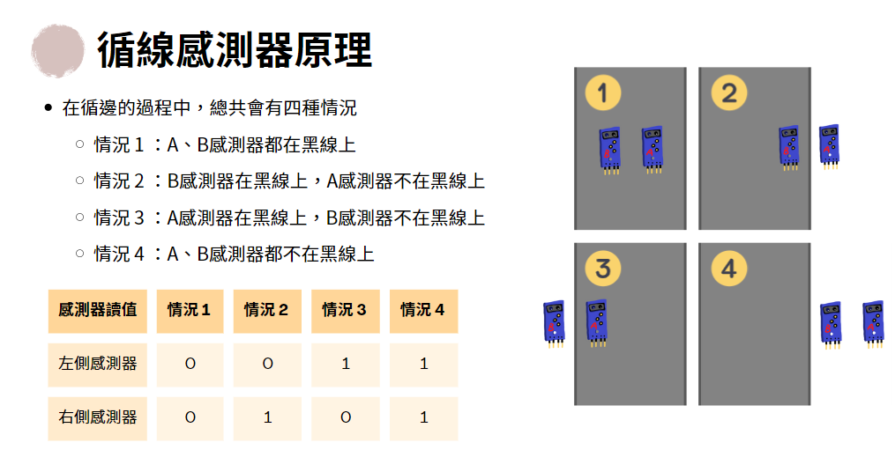
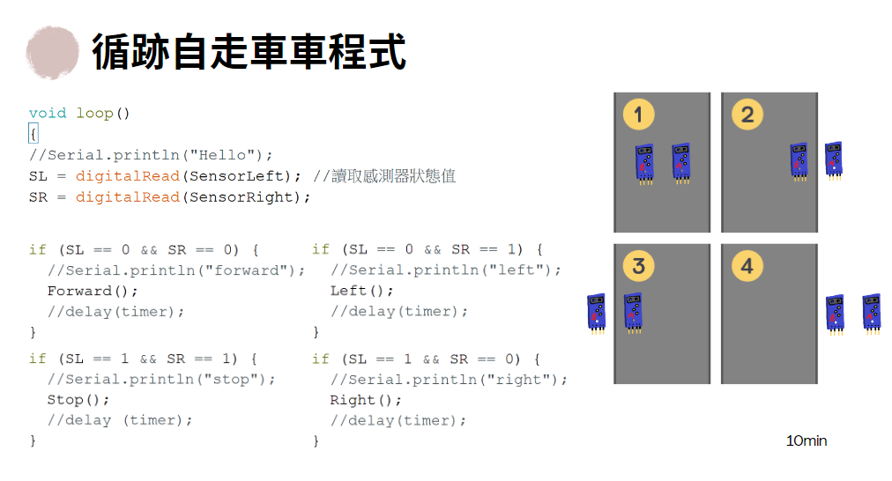

# 超音波及紅外線模組

## 時間

此段內容應講解時間：9:30~12:00

注意事項：工作人員需提早開電腦灌 UltraSonic 的套件庫，學校網路載不了

## 內容

### 第一段 超音波測距

可解釋原理，Trig 發送信號，Echo 接收信號，以發送與接收的時間差用音速計算距離。

可先教學如何載第三方模組(但學校電腦網路會被檔)

超音波模組使用 UltraSonic 模組

超音波模組共4個接腳，5V GND Trig Echo

腳位表

```
+5V -> 3 V

GND -> 3 G

Trig -> 2 S

Echo -> 3 S
```

```c
#include <Ultrasonic.h>

Ultrasonic ultrasonic(2, 3);

void setup() {
  Serial.begin(9600);
}

void loop() {
  int distance = ultrasonic.read();
  Serial.print(distance);
  Serial.println("cm");
  delay(500);
}
```

超音波測距題目

```
你有一隻小小的跟屁蟲，這台車車非常喜歡黏著你，總是緊緊跟隨在你的手手後面。當你移動手的位置時，車車也會隨之跟隨，保持一定距離不會離你太遠。
```

```c
#include <Ultrasonic.h>

Ultrasonic ultrasonic(2, 3);

int in1 = 8;
int in2 = 9;
int in3 = 10;
int in4 = 11;

int enA = 5;
int enB = 6;

void forward() {
  digitalWrite(in1, HIGH);
  digitalWrite(in2, LOW);
  digitalWrite(in3, HIGH);
  digitalWrite(in4, LOW);
}

void stop() {
  digitalWrtie(in1, LOW);
  digitalWrite(in2, LOW);
  digitalWrite(in3, LOW);
  digitalWrite(in4, LOW);
}

void motorSpeed(int rightSpeed, int leftSpeed) {
  digitalWrite(enA, rightSpeed);
  digitalWrite(enB, leftSpeed);
}

void setup() {
  pinMode(in1, OUTPUT);
  pinMode(in2, OUTPUT);
  pinMode(in3, OUTPUT);
  pinMode(in4, OUTPUT);
  pinMode(enA, OUTPUT);
  pinMode(enB, OUTPUT);
}

void loop() {
  int distance = ultrasonic.read();
  if(distance > 15) {
    forward();
  } else {
    stop();
  }

  motorSpeed(255, 255);
}
```

### 第二段 紅外線模組

可解釋原理，以一個類似光敏電阻的東西同時發射並接收紅外線光，會因為接收到的光亮產生數值的改變，接到 D0 腳位即只有數位訊號，可用螺絲控制閥值。





紅外線模組 Digital 腳位調整步驟

```
- 一開始拿到不管什麼顏色都會亮著

- 先將車車通電

- 把車子放到黑線上

- 拿出一字起子

- 轉至最右

- 在開始往左轉

- 直至綠燈熄滅

- 再多轉一點點
```

腳位表

左側
```
GND -> A0 G

VCC -> A0 V

D0 -> A0 S
```

右側
```
GND -> A1 G

VCC -> A1 V

D0 -> A1 S
```

並使用以下程式進行數據檢測

```c
int LD = A0;
int RD = A1;

void setup() {
  Serial.begin(9600);

  pinMode(LD, INPUT);
  pinMode(RD, INPUT);
}

void loop() {
  int leftValue = digitalRead(LD);
  int rightValue = digitalRead(RD);

  Serial.print("right: ");
  Serial.println(leftValue);
  Serial.print("left: ");
  Serial.println(rightValue);

  delay(500);
}
```

在這之後可教學類比腳位使用方式，在此模式下的紅外線輸出數值不會被螺絲鬆緊調節，輸出數值為 0(白) ~ 1023(黑)。

教學類比模式請將學生的 D0 腳位轉至 A0，並接到 Arduino 的 A 腳位上面。

並可使用以下程式進行數據檢測。

```c
int LD = A0;
int RD = A1;

void setup() {
  Serial.begin(9600);

  pinMode(LD, INPUT);
  pinMode(RD, INPUT);
}

void loop() {
  int leftValue = analogRead(LD);
  int rightValue = analogRead(RD);

  Serial.print("right: ");
  Serial.println(leftValue);
  Serial.print("left: ");
  Serial.println(rightValue);

  delay(500);
}
```

紅外線模組題目

```
寫出一個程式，當兩個感測器都感應到黑色就輸出"別壓在我身上啦"，當只有其中一個感應到就輸出"你壓到我了啦"，當沒有感應到黑線時就輸出"什麼都沒有發生..."。
```

解答

```c
int LD = A0;
int RD = A1;

int blackValue = 300;

void setup() {
  Serial.begin(9600);

  pinMode(LD, INPUT);
  pinMode(RD, INPUT);
}

void loop() {
  int leftValue = analogRead(LD);
  int rightValue = analogRead(RD);

  if(leftValue > blackValue && rightValue > blackValue) {
    Serial.println("別壓在我身上啦");
  } else if(leftValue > blackValue || rightValue > blackValue) {
    Serial.println("你壓到我了啦");
  } else {
    Serial.println("什麼事都沒有發生");
  }
}
```